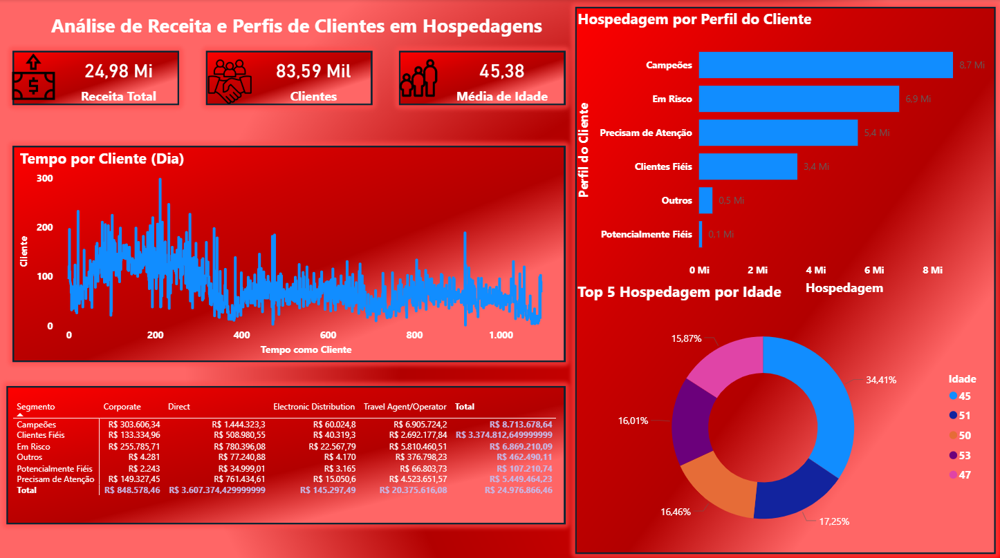

## 🏨 Análise de Hospedagem – Python, SQL e Power BI
---
### 📸 Prévia do Dashboard

## 📌 Sobre o Projeto

- Este projeto tem como objetivo analisar dados de hospedagem, segmentar clientes por perfil e gerar insights sobre receita, idade média e fidelização.

- A pipeline foi construída com:

- Python → limpeza dos dados, tratamento de valores ausentes e criação de colunas derivadas.

- SQL → consultas para estruturar tabelas e preparar dados para análise.

- Power BI → desenvolvimento de um dashboard interativo e visual.
---

## ⚙️ Tecnologias Utilizadas

- Python (Pandas, NumPy)

- SQL (MySQL / PostgreSQL / outro que usou)

- Power BI

## 📊 Dashboard

- O painel final apresenta:

- Receita total, número de clientes e idade média.

- Segmentação de clientes por perfil (Campeões, Em risco, Fiéis, etc.).

- Análise de hospedagem por idade.

- Tempo de relacionamento dos clientes.
---

## 🎯 Principais Insights do Dashboard
A análise revelou vários insights acionáveis que podem orientar a estratégia de negócio do hotel:

- Foco nos Clientes de Alto Valor: O segmento "Campeões", embora não seja o maior em número, é responsável pela maior fatia da receita, indicando a necessidade de programas de fidelidade e tratamento VIP para este grupo.

- Oportunidade de Retenção: Existe um grande   número de clientes no segmento "Em Risco". Uma campanha de reativação direcionada a este grupo, com ofertas personalizadas, pode gerar um retorno significativo sobre o investimento.

- Canal Direto é Mais Valioso: A análise cruzada na matriz revelou que os clientes que fazem reservas diretas tendem a pertencer a segmentos de maior valor, sugerindo que o hotel deve investir em estratégias para incentivar mais reservas através do seu próprio site.

- Perfil de Idade: A faixa etária entre os 40 e 59 anos é a mais lucrativa, fornecendo um alvo claro para campanhas de marketing e desenvolvimento de pacotes personalizados.

## 📬 Contato

🔗 LinkedIn - https://www.linkedin.com/in/juan-da-cunha-moreno-29752a222